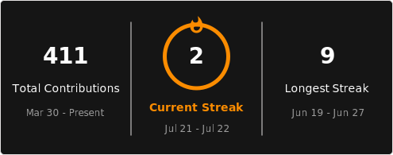

# Hi, I'm Wisdom Azaglo 👋
### DevOps & Platform Engineer

I am a **DevOps Engineer** with a strong foundation in automation, leveraging **Python** and **Bash** to build scalable and maintainable systems. I specialize in cloud architecture, containerization, orchestration, and infrastructure automation, with a deep interest in distributed systems and platform reliability.

Currently, I am working extensively with **Apache CloudStack** (on-prem) and have significant experience with **AWS** environments.

---

### 🛠️ Tech Stack

**Languages & Automation**

**Cloud & Infrastructure**

**Observability**

### 🔭 Currently Working On
* Building a centralized FreeIPA SSH MFA architecture with tiered access control (DEV/UAT/PROD)
* Automating CloudStack infrastructure with Terraform and Ansible
* Security-first CI/CD pipelines with DefectDojo and SonarQube

---

### 🤝 Collaboration & Open Source
*   👯 I’m looking to collaborate on **Open Source projects** in the virtualization and cloud-native space.
*   💬 Reach out if you want to talk about **Distributed Systems** or **Platform Reliability**.

---

### ⚡ Fun Fact
*   I believe an AI is only as good as the engineer using it. Mine just suggested I "try deleting the database." I'm scared because that's actually a good point.

---

### 📫 Connect with me

